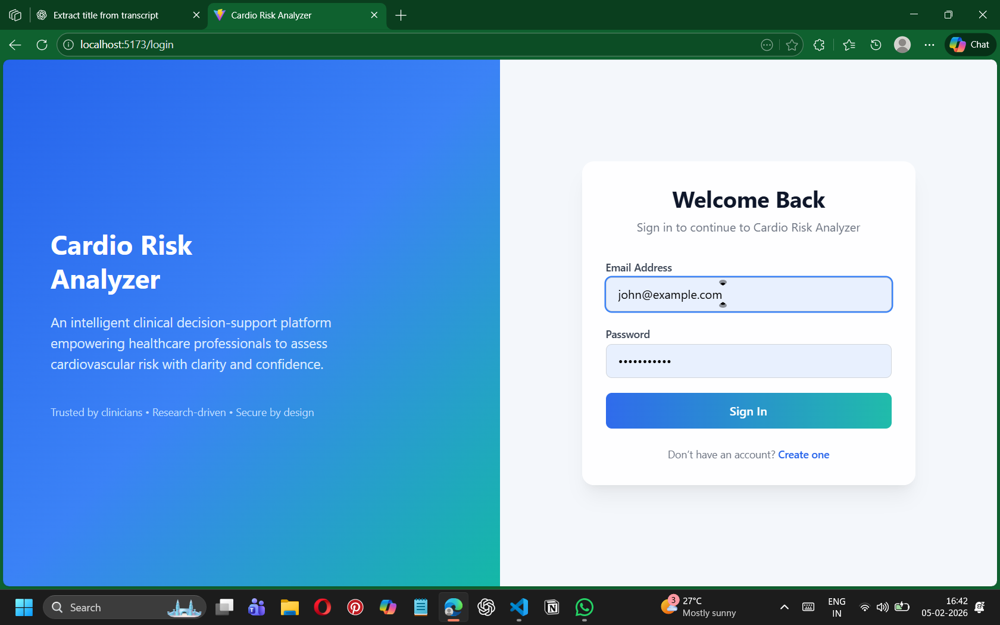
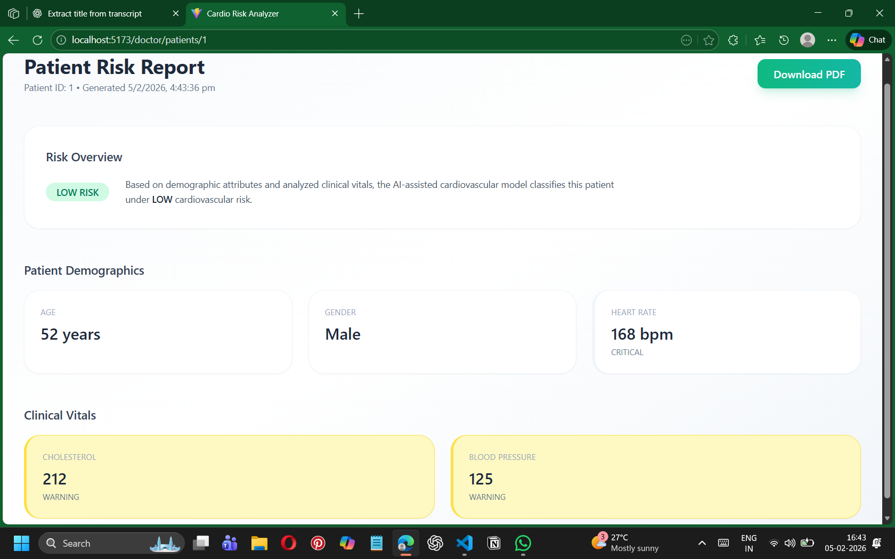
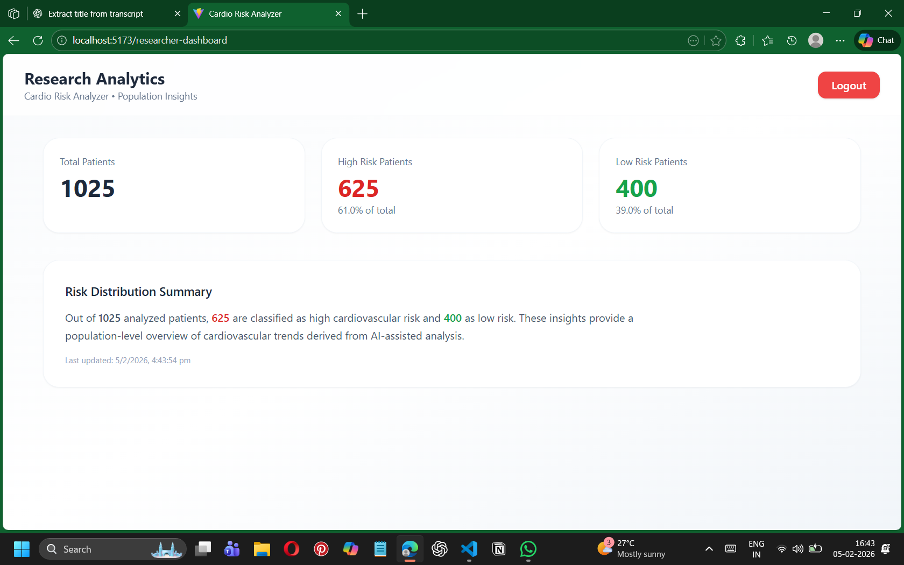

# 🫀 Cardio Risk Analyzer

A **role-based full‑stack web application** that analyzes patient health data to predict cardiovascular risk and provides actionable insights for doctors and researchers.

---

## 🚀 Project Overview

**Cardio Risk Analyzer** helps healthcare professionals make data‑driven decisions by:
- Predicting **heart disease risk** for individual patients
- Classifying patients into **High Risk** and **Low Risk**
- Providing **aggregated analytics** for medical researchers

The system is designed with **security, scalability, and clarity** in mind using modern full‑stack technologies.

---

## 👥 User Roles & Features

### 👨‍⚕️ Doctor
- Secure login
- View all patients
- Access detailed **patient reports**
- Analyze individual cardiovascular risk

### 🔬 Researcher
- Secure login
- View **total patient count**
- View **High Risk vs Low Risk** distribution
- Dashboard with summarized insights

---

## 🛠️ Tech Stack

### Frontend
- React.js
- Tailwind CSS
- React Router
- Axios

### Backend
- Node.js
- Express.js
- JWT Authentication
- Role‑based Access Control (RBAC)

### Data & Logic
- CSV‑based dataset
- Risk preprocessing & classification logic
- Custom heart‑risk analysis functions

---

## 📂 Project Structure

## 📁 Project Structure

```text
Cardio-risk-analyzer/
├── cardio-risk-backend/
│   ├── src/
│   │   ├── controllers/
│   │   │   └── patientController.js
│   │   ├── middleware/
│   │   │   └── authMiddleware.js
│   │   ├── routes/
│   │   │   └── patientRoutes.js
│   │   ├── services/
│   │   │   └── riskAnalysis.js
│   │   ├── utils/
│   │   │   └── preprocess.js
│   │   ├── app.js
│   │   └── server.js
│   ├── package.json
│   └── .env
│
├── cardio-risk-frontend/
│   ├── src/
│   │   ├── api/
│   │   │   └── api.js
│   │   ├── components/
│   │   │   ├── PatientList.jsx
│   │   │   ├── PatientReport.jsx
│   │   │   └── RiskBadge.jsx
│   │   ├── pages/
│   │   │   └── ResearcherSummary.jsx
│   │   ├── context/
│   │   │   └── AuthContext.jsx
│   │   ├── App.jsx
│   │   └── main.jsx
│   ├── package.json
│   └── vite.config.js
│
├──screenshots
├── heart.csv
├── LICENSE
└── README.md
```


---

## 🔐 Security Features

- JWT‑based authentication
- Protected routes
- Role‑specific API access
- Secure backend validation

---

## 📊 Key Highlights

- ✔ Full‑stack implementation
- ✔ Clean role separation (Doctor / Researcher)
- ✔ Real‑world healthcare use case
- ✔ Modular and scalable architecture
- ✔ Beginner‑friendly yet industry‑relevant

---

## ⚙️ How to Run the Project

### Backend and Frontend
```bash
cd cardio-risk-backend
npm install
npm run dev

cd cardio-risk-frontend
npm install
npm run dev
```

## 🖼️ Frontend Screenshots

### Signup Page


### Login Page


### Doctor Dashboard


### Patient Report Page


### Researcher Dashboard



📌 Future Enhancements
• Database integration (MongoDB / PostgreSQL)
• Advanced machine learning models for risk prediction
• Interactive data visualization (charts & graphs)
• Admin dashboard for system monitoring
• Cloud deployment (AWS / Azure / Render)

📄 License
This project is licensed under the MIT License.

🙌 Acknowledgements
Built as an academic full‑stack project to demonstrate:
• Secure authentication & authorization
• Backend API and business logic design
• Role‑based frontend dashboards
• Healthcare data analysis and risk assessment

